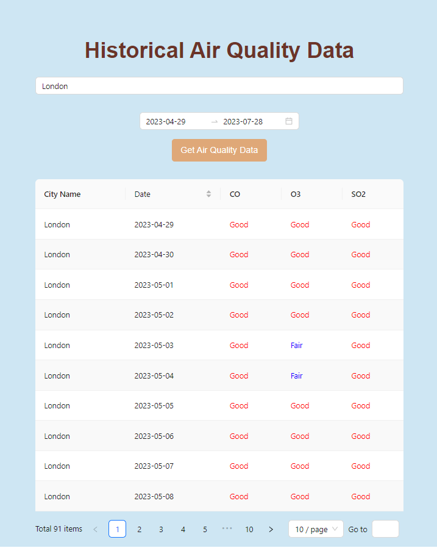

##  <div align="center"><h3 style="color: blue">Patika-Dev - OpenWeather API - Spring Boot - Java</h1></div>

    Project Description: It is a spring boot backend - vue3 frontend project that shows historical air quality data of cities, using OpenWeather API, and MongoDB.

## <div align="center"><h4 style="color: white">Installation</h1></div>
    
        1. Clone the project.
        2. Open the project in your IDE.
        3. Install docker and docker-compose. 
        4. Run the command: docker-compose up -d
        5. Build Gradle Project.
        6. Add MongoDB connection string to application.properties file.
        7. Add MongoDB connection to IDE.
        8. Run the project:
            8.a Run WebApplication.java
            8.b Run WorkerApplication.java
            8.c install vue3 frontend project and run it by going to cd frontend and run the command: npm run serve
        9. Go to http://localhost:5173/ and enjoy the project.

## <div align="center"><h4 style="line-height: 1.5; color: white">Usage</h4></div>

    1. MongoExpress is running on http://localhost:8081/
    2. RabbitMQ is running on http://localhost:15672/
    3. Vue3 frontend is running on http://localhost:5173/

## <div align="center"><h4 style="line-height: 1.5; color: white">Queues</h4></div>

    1. Go to RabbitMQ (which should be already installed and running on http://localhost:15672/) and create a virtual host named "guest".
    2. Create queues whose names are located in application.properties files of both modules.
    3. Bind queues to exchanges whose names are located in application.properties files of both modules.

## <div align="center"><h4 style="line-height: 1.5; color: white">Endpoints</h4></div>

        GET http://localhost:8080/cities/{{cityName}}?startDate={{startDate}}&endDate={{endDate}}&page={{page}}&size={{size}}
        GET http://localhost:8080/coordinates/queue/{{cityName}}
        GET http://localhost:8080/coordinates/{{cityName}}


## <div align="center"><h4 style="line-height: 1.5; color: white">API Key</h4></div>

    1. Go to https://openweathermap.org/api and create an account.
    2. Get your API key.
    3. Add your API key to application.properties file of worker module.

## <div align="center"><h4 style="line-height: 1.5; color: white">Example Request</h4></div> 

    GET http://localhost:8080/cities/istanbul?startDate=2021-08-01&endDate=2021-08-03&page=0&size=3

## <div align="center"><h4 style="line-height: 1.5; color: white">Example Response</h4></div>



```bson
{
    "content": [
        {
            "cityName": "istanbul",
            cityResults: 
            {
                "date": "2022-08-01",
                "cityCategories": {o3: 'Fair', co: 'Good', so2: 'Good'}
            }
        },
        {
            "cityName": "istanbul",
            cityResults: 
            {
                "date": "2022-08-02",
                cityCategories: {o3: 'Moderate', co: 'Poor', so2: 'Good'}
            }
        },
        {
            "cityName": "istanbul",
            cityResults: 
            {
                "date": "2022-08-03",
                cityCategories: {o3: 'Fair', co: 'Good', so2: 'Good'}
            }
        }
    ],
    "pageable": {
        "sort": {
            "sorted": false,
            "unsorted": true,
            "empty": true
        },
        "offset": 0,
        "pageNumber": 0,
        "pageSize": 3,
        "paged": true,
        "unpaged": false
    },
    "totalPages": 1,
    "totalElements": 3,
    "last": true,
    "size": 3,
}
```


